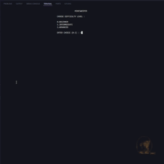
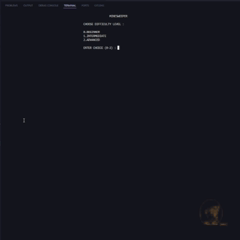
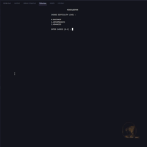

# [TERMINAL GAME] 💥 Minesweeper

A fully playable **MineSweeper game** built in **C++**, featuring **Object-Oriented Programming (OOP)** architecture and **ANSI escape codes** for colorful, dynamic terminal rendering.

---

## 🎮 Features
- **OOP Architecture** – Each block type and game logic is encapsulated in its own class for cleaner, modular code.
- **Colorful Gameplay** – Uses **ANSI escape codes** for multi-colored tetromino pieces and UI elements.
- **Real-time Controls** – Smooth keyboard input without waiting for Enter.
- **Score Tracking** – Keeps track of your performance.
- **Clear Board Rendering** – Optimized terminal drawing for minimal flicker.

---

## 🖼 Demo

### Level Easy


### Level Medium


### Level Hard



---

## 📂 Project Structure

```
+-------------------+
|  Start Program    |
+---------+---------+
          |
          v
+-------------------+
| chooseDifficulty  |
|  (set side/mines) |
+---------+---------+
          |
          v
+-------------------------+
| initialiseBoards()      |
| placeMines()            |
+-----------+-------------+
            |
            v
     +------+------+
     |  Game Loop  |
     +------+------+
            |
            v
+---------------------------+
| printBoard(myBoard)       |
+-------------+-------------+
              |
              v
+---------------------------------------------+
| Read input: (row, col) or R(eboot)/Q(uit)   |
+-------------------+-------------------------+
        R/Q?        |
   +----+----+      |
   |  Yes    |      | No
   v         |      v
+------+     |  +----------------------+
| Quit |<----+--| first move & mine?   |
+------+        +----------+-----------+
                           | Yes
                           v
                 +-------------------+
                 | replaceMine(x,y)  |
                 +---------+---------+
                           |
                           v
                 +-------------------+
                 | playMinesUntil    |
                 |     (x, y)        |
                 +---------+---------+
                           |
                           v
             +-------------+--------------+
             | movesLeft == 0 ? You Won!  |
             +-------------+--------------+
                           |
                           v
                    +------+------+
                    | game over?  |
                    +------+------+ 
                           |Yes
                           v
                 +-------------------+
                 | Restart or Exit   |
                 +-------------------+
```
## 🕹️ Symbols meaning

> [!NOTE]  
> '-' : unrevealed cell  
> ' ' : revealed empty cell (no adjacent mines)  
> '1'..'6' : number of adjacent mines  
> '*' : mine  
> BG_* : ANSI background color for cell type  
> RESET : ANSI reset  

--- 
## 💡 Future Improvements

- Add a preview block window.
- Play sound effects when hit mines.
- Add difficulty levels for number of mines and side
- Store high scores in a file.

---

## 🤝 Contributing
Pull requests are welcome! For major changes, please open an issue first to discuss your ideas.

---

> **💡 If you like this project, give it a star!** ⭐  
> Your support helps keep the project alive and growing 🚀


